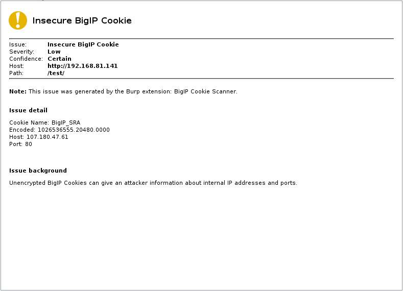
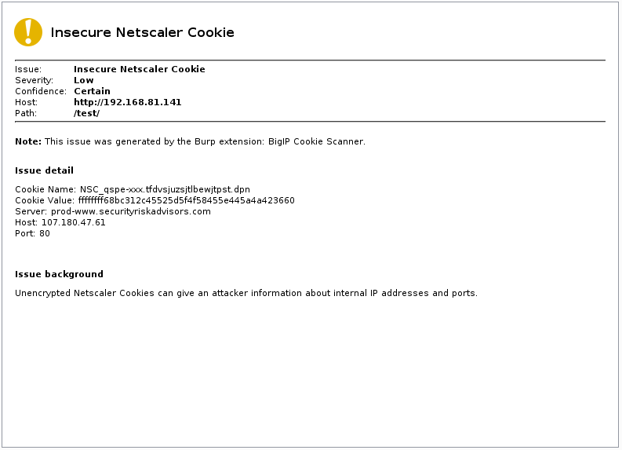

# Load Balancer Cookie Scanner for Burp
Burp Extension for automatically finding and decoding insecure BigIP and Netscaler cookies

## Features
 * Passively scan sites for insecure BigIP and Netscaler cookies
 * Automatically decode the cookies

## Limitations
 * Only searches in the response, so clear cookies before use if you've visited the site before.

## Usage
 1. Download loadbalancer_cookies.jar and load it into Burp Suite using the Extender.
 2. Visit a website with an insecure load balancer cookie.
 3. See the issue in the Issues pane with the decoded value.

## Screenshots
BigIP:

Netscaler:

